# GitHub Pages 部署完整指南

## 🎯 部署方案選擇

### 方案1：使用Release分支部署（推薦）

**優點**：
- ✅ 只部署穩定的發布版本
- ✅ 與現有的自動化流程完美整合
- ✅ 避免開發中的代碼被部署

**工作流程**：
1. 運行 `npm run version:patch` 更新版本
2. 自動推送到release分支
3. 自動部署到GitHub Pages

### 方案2：從Main分支部署

**優點**：
- ✅ 每次代碼更新都會自動部署
- ✅ 適合持續集成

**缺點**：
- ❌ 可能部署未完成的代碼
- ❌ 部署頻率較高

## 🚀 部署步驟

### 步驟1：選擇部署方案

**選擇方案1（推薦）**：
```bash
# 刪除不需要的配置文件
rm .github/workflows/pages-main.yml
rm .github/workflows/pages.yml
```

**選擇方案2**：
```bash
# 刪除不需要的配置文件
rm .github/workflows/pages-deploy.yml
rm .github/workflows/pages.yml
```

### 步驟2：配置GitHub Pages

1. **前往GitHub倉庫設置**：
   - 進入您的GitHub倉庫
   - 點擊 "Settings" 標籤

2. **設置Pages源**：
   - 在左側選單找到 "Pages" 選項
   - 在 "Source" 部分選擇 "GitHub Actions"
   - 點擊 "Save" 保存設置

### 步驟3：提交配置文件

```bash
# 添加Pages部署配置
git add .github/workflows/pages-deploy.yml
git commit -m "feat: 添加GitHub Pages部署配置"
git push origin main
```

### 步驟4：測試部署

**方案1測試**：
```bash
# 發布新版本
npm run version:patch

# 檢查GitHub Actions是否執行
# 1. 前往Actions頁面查看release工作流程
# 2. 等待完成後查看pages-deploy工作流程
```

**方案2測試**：
```bash
# 推送代碼變更
git add .
git commit -m "test: 測試Pages部署"
git push origin main

# 檢查GitHub Actions是否執行
# 前往Actions頁面查看pages-main工作流程
```

## 📋 部署後檢查

### 檢查部署狀態

1. **GitHub Actions頁面**：
   - 檢查工作流程是否成功執行
   - 查看部署日誌

2. **Pages設置頁面**：
   - 確認部署狀態為 "Deployed"
   - 記下您的網站URL

3. **訪問網站**：
   - 前往 `https://您的用戶名.github.io/您的倉庫名`
   - 確認網站正常運行

### 常見問題排查

**問題1：部署失敗**
```bash
# 檢查構建日誌
# 常見原因：依賴安裝失敗、構建錯誤
```

**問題2：網站無法訪問**
```bash
# 檢查Pages設置
# 確認Source設置為"GitHub Actions"
```

**問題3：內容不更新**
```bash
# 清除瀏覽器緩存
# 檢查GitHub Actions是否正常執行
```

## 🔧 自定義配置

### 修改部署路徑

如果您想部署到子目錄：

```yaml
# 在workflow文件中修改
- name: Upload artifact
  uses: actions/upload-pages-artifact@v3
  with:
    path: './dist'  # 改為您的構建目錄
```

### 添加自定義域名

1. **添加CNAME文件**：
```bash
echo "your-domain.com" > public/CNAME
```

2. **在GitHub Pages設置中添加自定義域名**

### 環境變量配置

```yaml
# 在workflow中添加環境變量
- name: Build
  run: npm run build
  env:
    VITE_API_URL: ${{ secrets.VITE_API_URL }}
```

## 📊 部署監控

### 自動化部署流程

**方案1完整流程**：

```mermaid
graph LR
    A[版本更新] --> B[創建Tag]
    B --> C[Release工作流程]
    C --> D[推送到Release分支]
    D --> E[Pages部署工作流程]
    E --> F[部署到GitHub Pages]
```


**方案2完整流程**：

```mermaid
graph LR
    A[代碼推送] --> B[Pages部署工作流程]
    B --> C[構建項目]
    C --> D[部署到GitHub Pages]
```


## 🎉 完成部署

部署完成後，您的麻將計分工具將可以在以下網址訪問：

```
https://您的GitHub用戶名.github.io/您的倉庫名
```

### 下一步

1. **測試網站功能**
2. **配置自定義域名**（可選）
3. **設置自動化部署監控**
4. **優化網站性能**

## 📞 支援

如果遇到問題，請檢查：
- [GitHub Actions文檔](https://docs.github.com/en/actions)
- [GitHub Pages文檔](https://docs.github.com/en/pages)
- 專案的GitHub Issues頁面
